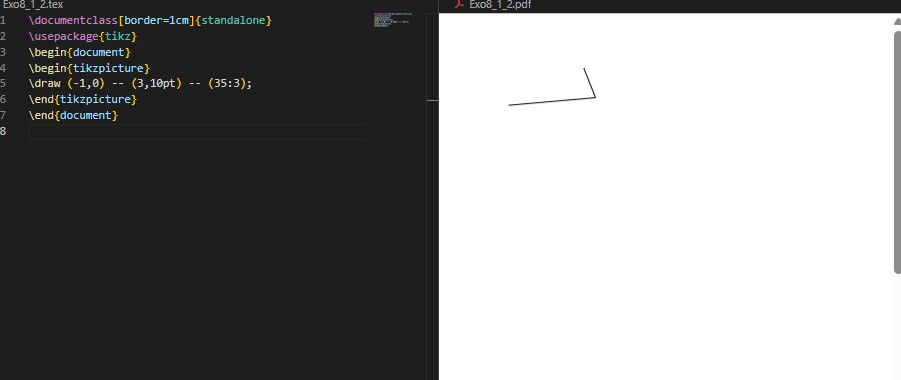
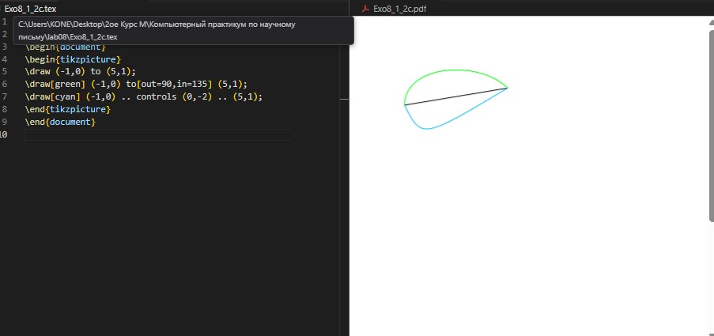
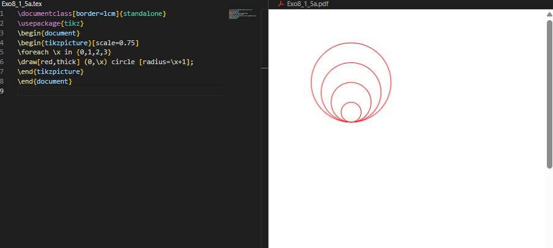
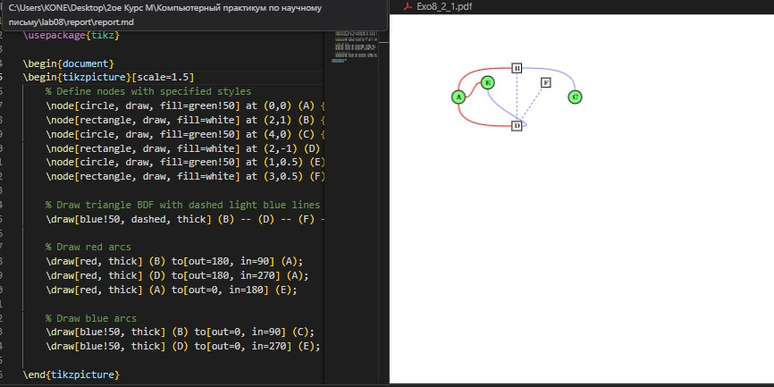
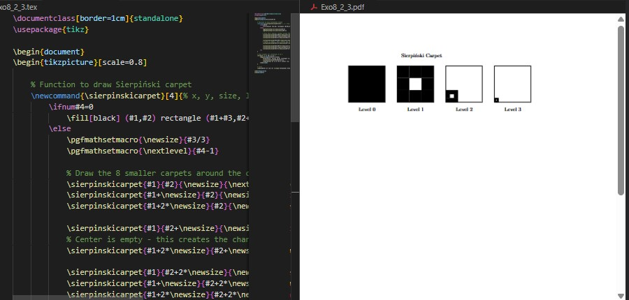

---
## Front matter
lang: ru-RU
title: Презентация лабораторной работе №8  
subtitle: Diagrams and Drawings as Code
author:
  - Оффей Эндрю
institute:
  - Российский университет дружбы народов, Москва, Россия
date: 30 Ноября 2025

## i18n babel
babel-lang: russian
babel-otherlangs: english

## Formatting pdf
toc: false
toc-title: Содержание
slide_level: 2
aspectratio: 169
section-titles: true
theme: metropolis
header-includes:
 - \metroset{progressbar=frametitle,sectionpage=progressbar,numbering=fraction}
---

# Информация

## Докладчик

:::::::::::::: {.columns align=center}
::: {.column width="70%"}

  * Оффей Эндрю
  * Студент физмат
  * Российский университет дружбы народов

:::
::: {.column width="30%"}

:::
::::::::::::::

## Цель работы

Целью данной лабораторной работы является освоение создания диаграмм и рисунков программным способом в LaTeX с использованием пакета TikZ и других инструментов для визуального представления данных и математических объектов.

The purpose of this lab work is to learn how to create diagrams and drawings programmatically in LaTeX using the TikZ package and other tools for visual representation of data and mathematical objects.

## Задание

1. Изучить основы создания графики с помощью пакета TikZ
2. Освоить построение линий, кривых и узлов в TikZ
3. Научиться создавать сложные графики и диаграммы

# Теоретическое введение

## 8 Диаграммы и рисунки как код / Diagrams and Drawings as Code

TikZ - мощный пакет для создания графики программным способом в LaTeX.
TikZ is a powerful package for creating graphics programmatically in LaTeX.

## 8.1 TikZ - Основы / TikZ Basics

Основные элементы: линии, узлы, кривые и системы координат.
Basic elements: lines, nodes, curves and coordinate systems.

{width=80%}

## Строительные блоки TikZ / Building Blocks

:::::::::::::: {.columns align=center}
::: {.column width="50%"}

**Рисование линий**
{width=90%}

:::
::: {.column width="50%"}

**Узлы и метки**
{width=90%}

:::
::::::::::::::

## Возможности TikZ / TikZ Capabilities

:::::::::::::: {.columns align=center}
::: {.column width="33%"}

**Графики функций**
{width=90%}

:::
::: {.column width="33%"}

**Циклы и повторения**
{width=90%}

:::
::: {.column width="33%"}

**Стили и цвета**
{width=90%}

:::
::::::::::::::

# Выполнение лабораторной работы

## Упражнение 1: Создание графа / Exercise 1: Graph Creation

**Ориентированный граф с узлами и связями**
{width=80%}

## Упражнение 2: Графики функций / Exercise 2: Function Graphs

:::::::::::::: {.columns align=center}
::: {.column width="60%"}

**Экспонента и логарифм**
{width=95%}

:::
::: {.column width="40%"}

**Функции:**
- $y = e^x$
- $y = \ln(x)$  
- $y = 1$
- $x = 1$

**Особенности:**
- Система координат
- Сетка
- Метки точек

:::
::::::::::::::

## Упражнение 3: Фракталы / Exercise 3: Fractals

:::::::::::::: {.columns align=center}
::: {.column width="50%"}

**Ковёр Серпинского**
{width=90%}

:::
::: {.column width="50%"}

**Треугольник Серпинского**
{width=90%}

:::
::::::::::::::

# Выводы

В ходе лабораторной работы №8 я освоил создание диаграмм и рисунков программным способом в LaTeX с использованием пакета TikZ. Изучил основы построения линий, кривых и узлов, освоил создание сложных графиков функций и фрактальных структур.

In this lab work 8, I mastered creating diagrams and drawings programmatically in LaTeX using the TikZ package. I studied the basics of constructing lines, curves and nodes, mastered creating complex function graphs and fractal structures.

# Список литературы

# Спасибо за внимание