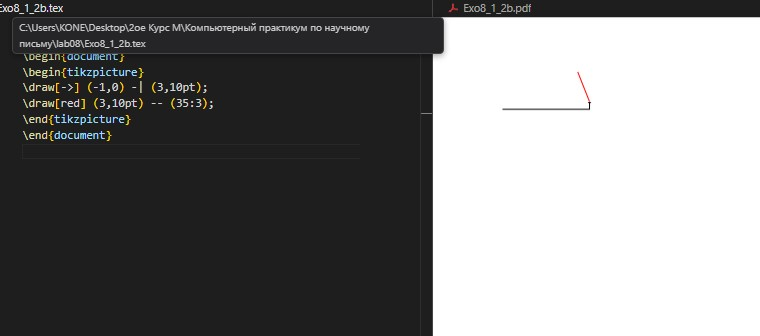
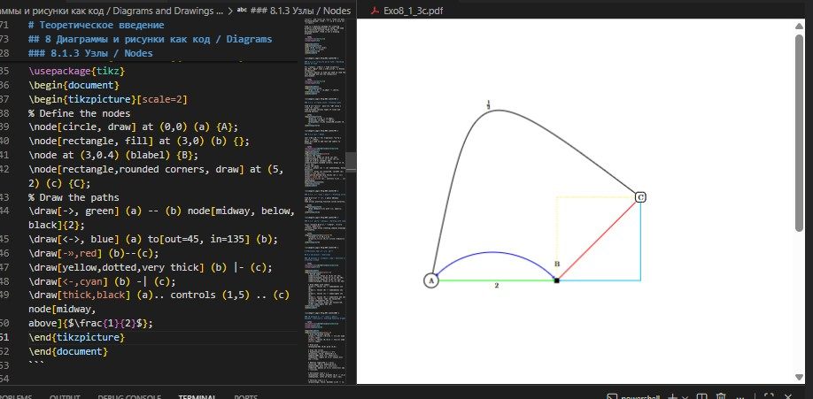
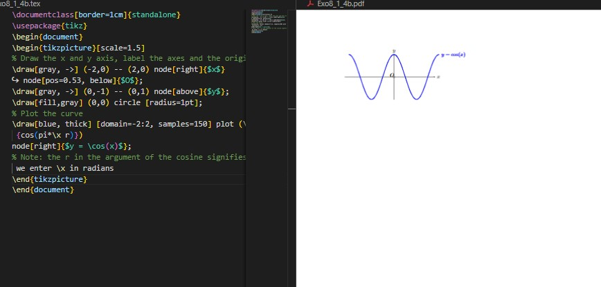
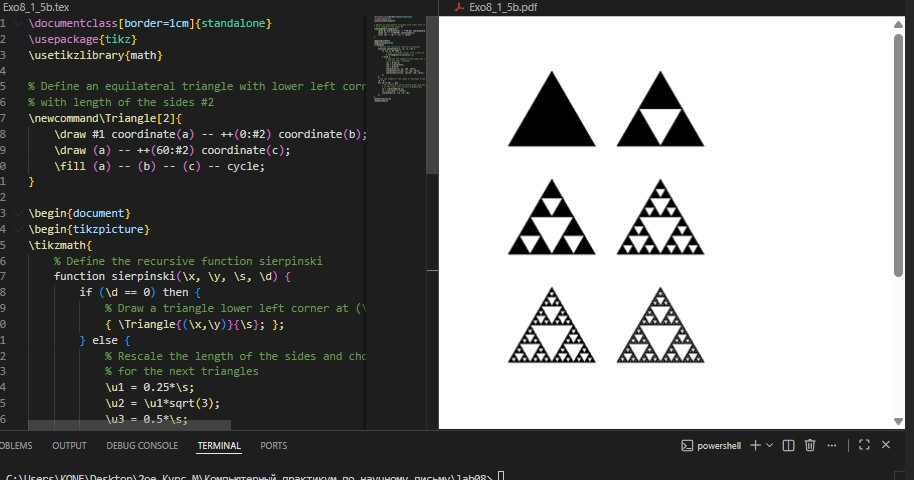
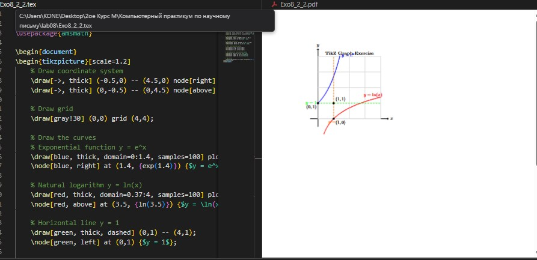

---
## Front matter
title: "Отчёт по лабораторной работе №8"
subtitle: "Diagrams and Drawings as Code"
author: "Оффей Эндрю"

## Generic options
lang: ru-RU
toc-title: "Содержание"

## Bibliography
bibliography: bib/cite.bib
csl: pandoc/csl/gost-r-7-0-5-2008-numeric.csl

## Pdf output format
toc: true
toc-depth: 2
lof: true
lot: true
fontsize: 12pt
linestretch: 1.5
papersize: a4
documentclass: scrreprt

## I18n polyglossia
polyglossia-lang:
  name: russian
  options:
    - spelling=modern
    - babelshorthands=true
polyglossia-otherlangs:
  name: english

## I18n babel
babel-lang: russian
babel-otherlangs: english

## Fonts
mainfont: IBM Plex Serif
romanfont: IBM Plex Serif
sansfont: IBM Plex Sans
monofont: IBM Plex Mono
mathfont: STIX Two Math

## Biblatex
biblatex: true
biblio-style: "gost-numeric"

## Misc options
indent: true
header-includes:
  - \usepackage{indentfirst}
  - \usepackage{float}
  - \floatplacement{figure}{H}
---

# Цель работы

Целью данной лабораторной работы является освоение создания диаграмм и рисунков программным способом в LaTeX с использованием пакета TikZ и других инструментов для визуального представления данных и математических объектов.

The purpose of this lab work is to learn how to create diagrams and drawings programmatically in LaTeX using the TikZ package and other tools for visual representation of data and mathematical objects.

# Задание
1. Изучить основы создания графики с помощью пакета TikZ
2. Освоить построение линий, кривых и узлов в TikZ
3. Научиться создавать сложные графики и диаграммы
4. Изучить построение фракталов и рекурсивных структур
5. Выполнить практические упражнения по созданию графиков и фракталов
6. Создать график функций и ковёр Серпинского

# Теоретическое введение

## 8 Диаграммы и рисунки как код / Diagrams and Drawings as Code

### 8.1 TikZ

TikZ - это мощный пакет для создания графики программным способом в LaTeX. Название является рекурсивным акронимом "TikZ ist kein Zeichenprogramm" (TikZ - это не программа для рисования).

TikZ is a powerful package for creating graphics programmatically in LaTeX. The name is a recursive acronym "TikZ ist kein Zeichenprogramm" (TikZ is not a drawing program).

```latex
\documentclass{article}
\usepackage{tikz}

\begin{document}
\begin{tikzpicture}
\draw (0,0) circle (1cm);
\draw (-1,0) -- (1,0);
\end{tikzpicture}
\end{document}
```

{ #fig:001 width=70% }

### 8.1.1 Строительные блоки TikZ / Building Blocks of TikZ

Для создания рисунков в TikZ необходимо загрузить пакет tikz и использовать окружение tikzpicture.
To create figures in TikZ you need to load the tikz package and use the tikzpicture environment.

```latex
\documentclass{article}
\usepackage{tikz}

\begin{document}
\begin{tikzpicture}
    \draw (-1,0) -- (3,10pt) -- (35:3);
\end{tikzpicture}
\end{document}
```

{ #fig:002 width=70% }

### 8.1.2 Рисование линий / Drawing Lines

TikZ предоставляет различные типы линий и стили оформления.
TikZ provides various types of lines and styling options.

```latex
\begin{tikzpicture}
    \draw[->] (-1,0) -| (3,10pt);
    \draw[red] (3,10pt) -- (35:3);
    \draw[green] (-1,0) to[out=90,in=135] (5,1);
\end{tikzpicture}
```

{ #fig:003 width=70% }

### 8.1.3 Узлы / Nodes

Узлы используются для добавления текста и меток в рисунки.
Nodes are used to add text and labels to drawings.

```latex
\documentclass[border=1cm]{standalone}
\usepackage{tikz}
\begin{document}
\begin{tikzpicture}[scale=2]
% Define the nodes
\node[circle, draw] at (0,0) (a) {A};
\node[rectangle, fill] at (3,0) (b) {};
\node at (3,0.4) (blabel) {B};
\node[rectangle,rounded corners, draw] at (5,2) (c) {C};
% Draw the paths
\draw[->, green] (a) -- (b) node[midway, below,black]{2};
\draw[<->, blue] (a) to[out=45, in=135] (b);
\draw[-»,red] (b)--(c);
\draw[yellow,dotted,very thick] (b) |- (c);
\draw[<-,cyan] (b) -| (c);
\draw[thick,black] (a).. controls (1,5) .. (c) node[midway,
above]{$\frac{1}{2}$};
\end{tikzpicture}
\end{document}
```

{ #fig:004 width=70% }

### 8.1.4 Построение графиков / Plotting Curves

TikZ позволяет строить графики функций напрямую.
TikZ allows plotting function curves directly.

```latex
\documentclass[border=1cm]{standalone}
\usepackage{tikz}
\begin{document}
\begin{tikzpicture}[scale=1.5]
% Draw the x and y axis, label the axes and the origin
\draw[gray, ->] (-2,0) -- (2,0) node[right]{$x$}
node[pos=0.53, below]{$O$};
\draw[gray, ->] (0,-1) -- (0,1) node[above]{$y$};
\draw[fill,gray] (0,0) circle [radius=1pt];
% Plot the curve
\draw[blue, thick] [domain=-2:2, samples=150] plot (\x,
 {cos(pi*\x r)})
node[right]{$y = \cos(x)$};
% Note: the r in the argument of the cosine signifies that
 we enter \x in radians
\end{tikzpicture}
\end{document}
```

{ #fig:005 width=70% }

### 8.1.5 Работа с циклами / Working with Loops

Циклы \\foreach позволяют создавать сложные рисунки эффективно.
\\foreach loops allow creating complex drawings efficiently.

```latex
\begin{tikzpicture}[scale=0.75]
    \foreach \x in {0,1,2,3}
    \draw[red,thick] (0,\x) circle [radius=\x+1];
\end{tikzpicture}
```

{ #fig:006 width=70% }

# Выполнение лабораторной работы

## 8.2 Упражнения / Exercises

### Упражнение 1: Создание графа / Exercise 1: Creating a Graph

```latex
\documentclass[border=1cm]{standalone}
\usepackage{tikz}

\begin{document}
\begin{tikzpicture}[scale=1.5]
    % Define nodes with specified styles
    \node[circle, draw, fill=green!50] at (0,0) (A) {A};
    \node[rectangle, draw, fill=white] at (2,1) (B) {B};
    \node[circle, draw, fill=green!50] at (4,0) (C) {C};
    \node[rectangle, draw, fill=white] at (2,-1) (D) {D};
    \node[circle, draw, fill=green!50] at (1,0.5) (E) {E};
    \node[rectangle, draw, fill=white] at (3,0.5) (F) {F};
    
    % Draw triangle BDF with dashed light blue lines
    \draw[blue!50, dashed, thick] (B) -- (D) -- (F) -- cycle;
    
    % Draw red arcs
    \draw[red, thick] (B) to[out=180, in=90] (A);
    \draw[red, thick] (D) to[out=180, in=270] (A);
    \draw[red, thick] (A) to[out=0, in=180] (E);
    
    % Draw blue arcs
    \draw[blue!50, thick] (B) to[out=0, in=90] (C);
    \draw[blue!50, thick] (D) to[out=0, in=270] (E);
    
\end{tikzpicture}
\end{document}
```

{ #fig:007 width=100% }

### Упражнение 2: Построение графиков функций / Exercise 2: Plotting Function Graphs

```latex
\documentclass[border=1cm]{standalone}
\usepackage{tikz}
\usepackage{amsmath}

\begin{document}
\begin{tikzpicture}[scale=1.2]
    % Draw coordinate system
    \draw[->, thick] (-0.5,0) -- (4.5,0) node[right] {$x$};
    \draw[->, thick] (0,-0.5) -- (0,4.5) node[above] {$y$};
    
    % Draw grid
    \draw[gray!30] (0,0) grid (4,4);
    
    % Draw the curves
    % Exponential function y = e^x
    \draw[blue, thick, domain=0:1.4, samples=100] plot (\x, {exp(\x)});
    \node[blue, right] at (1.4, {exp(1.4)}) {$y = e^x$};
    
    % Natural logarithm y = ln(x)
    \draw[red, thick, domain=0.37:4, samples=100] plot (\x, {ln(\x)});
    \node[red, above] at (3.5, {ln(3.5)}) {$y = \ln(x)$};
    
    % Horizontal line y = 1
    \draw[green, thick, dashed] (0,1) -- (4,1);
    \node[green, left] at (0,1) {$y = 1$};
    
    % Vertical line x = 1
    \draw[orange, thick, dashed] (1,0) -- (1,4);
    \node[orange, below] at (1,0) {$x = 1$};
    
    % Mark intersection points
    \fill[black] (0,1) circle (2pt);
    \fill[black] (1,0) circle (2pt);
    \fill[black] (1,1) circle (2pt);
    
    % Add labels for intersection points
    \node[below left] at (0,1) {$(0,1)$};
    \node[below right] at (1,0) {$(1,0)$};
    \node[above right] at (1,1) {$(1,1)$};
    
    % Add title
    \node[align=center] at (2,4.2) {\textbf{TikZ Graph Exercise}};
\end{tikzpicture}
\end{document}
```

{ #fig:008 width=100% }

### Упражнение 3: Ковёр Серпинского / Exercise 3: Sierpiński Carpet

```latex
\documentclass[border=1cm]{standalone}
\usepackage{tikz}

% Function to draw Sierpiński carpet
\newcommand{\sierpinskicarpet}[4]{% x, y, size, level
    \ifnum#4=0
        \fill[black] (#1,#2) rectangle (#1+#3,#2+#3);
    \else
        \pgfmathsetmacro{\newsize}{#3/3}
        \pgfmathsetmacro{\nextlevel}{#4-1}
        
        % Draw the 8 smaller carpets around the center hole
        \sierpinskicarpet{#1}{#2}{\newsize}{\nextlevel}% bottom-left
        \sierpinskicarpet{#1+\newsize}{#2}{\newsize}{\nextlevel}% bottom-middle
        \sierpinskicarpet{#1+2*\newsize}{#2}{\newsize}{\nextlevel}% bottom-right
        
        \sierpinskicarpet{#1}{#2+\newsize}{\newsize}{\nextlevel}% middle-left
        % Center is empty - this creates the characteristic hole
        \sierpinskicarpet{#1+2*\newsize}{#2+\newsize}{\newsize}{\nextlevel}% middle-right
        
        \sierpinskicarpet{#1}{#2+2*\newsize}{\newsize}{\nextlevel}% top-left
        \sierpinskicarpet{#1+\newsize}{#2+2*\newsize}{\newsize}{\nextlevel}% top-middle
        \sierpinskicarpet{#1+2*\newsize}{#2+2*\newsize}{\newsize}{\nextlevel}% top-right
    \fi
}

\begin{document}
\begin{tikzpicture}
    % Draw carpets for iterations 0 to 3
    \foreach \i in {0,1,2,3} {
        \begin{scope}[xshift=\i*4cm]
            \draw[black, thick] (0,0) rectangle (3,3);
            \sierpinskicarpet{0}{0}{3}{\i}
            \node[below] at (1.5,-0.3) {Level \i};
        \end{scope}
    }
    
    % Title
    \node[above] at (6,3.5) {\Large Sierpiński Carpet};
\end{tikzpicture}
\end{document}
```

{ #fig:009 width=100% }

# Выводы

В ходе лабораторной работы №8 я освоил создание диаграмм и рисунков программным способом в LaTeX с использованием пакета TikZ. Изучил основы построения линий, кривых и узлов, освоил создание сложных графиков функций и фрактальных структур. На практике создал различные типы графиков, включая математические функции и рекурсивные структуры такие как ковёр Серпинского и треугольник Серпинского. Полученные навыки позволяют создавать профессиональные научные иллюстрации непосредственно в LaTeX документах.

In this lab work 8, I mastered creating diagrams and drawings programmatically in LaTeX using the TikZ package. I studied the basics of constructing lines, curves and nodes, mastered creating complex function graphs and fractal structures. In practice, I created various types of graphs, including mathematical functions and recursive structures such as Sierpiński carpet and Sierpiński triangle. The acquired skills allow creating professional scientific illustrations directly in LaTeX documents.

:::refs
::